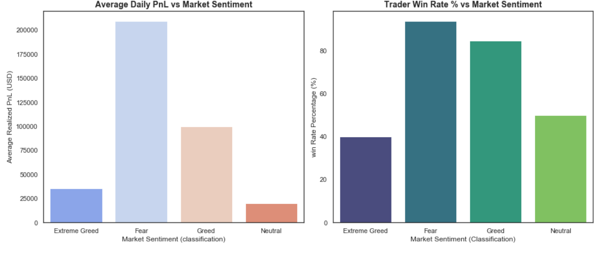

# Writeup — Trader Behavior vs Market Sentiment

## Methodology
I used two datasets: Hyperliquid trade-level data (211,224 trades) and the
Bitcoin Fear/Greed index (2,644 days). Trade timestamps were converted from
Unix milliseconds to daily dates and merged with the sentiment index on date.
For each trader, I built daily metrics — realized PnL, trade count, total
volume, and long/short ratio — then grouped these by sentiment classification
(Extreme Greed, Greed, Neutral, Fear) to compare behavior and performance
across market moods. The final merged dataset covered 77 trader-days across
4 sentiment categories.

## Findings

| Sentiment | Days | Avg Daily PnL | Win Rate | Avg Trades/Day | Avg Long/Short Ratio |
|---|---|---|---|---|---|
| Extreme Greed | 5 | $35,393 | 40.0% | 1,392 | 1.76 (long-heavy) |
| Fear | 32 | $209,373 | 93.75% | 4,183 | 0.97 (balanced) |
| Greed | 32 | $99,676 | 84.38% | 1,134 | 0.76 (short-leaning) |
| Neutral | 8 | $19,843 | 50.0% | 893 | 1.24 |

The standout result: **traders performed best during Fear, not Greed.**
Average daily PnL and win rate were both highest on Fear days (93.75% win
rate, ~$209K average PnL), while Extreme Greed days had the lowest win rate
(40%) despite traders being the most long-biased (ratio 1.76) — suggesting
they were chasing the pump near local tops and getting caught on reversals.

Trading activity also spiked sharply on Fear days (4,183 trades/day vs
~1,100-1,400 on Greed/Extreme Greed days), meaning traders were most active
exactly when performing best — consistent with disciplined dip-buying or
short-side positioning rather than panic trading.

## Charts

## Strategy Ideas
- **Extreme Greed is the highest-risk zone, not Fear.** With the lowest win
  rate (40%) and heaviest long bias, traders chasing momentum during euphoric
  tops underperform — position size and leverage limits should tighten here,
  not loosen.
- **Fear days reward activity, not caution.** The highest win rate and PnL
  occurred on Fear days with the most trades placed — this contradicts the
  common assumption that traders should reduce activity during fear, and
  instead suggests disciplined dip-buying or shorting is being rewarded.
- A useful signal: **watch the long/short ratio alongside sentiment** —
  traders leaning long into Extreme Greed (ratio 1.76) is a warning sign for
  overextension, more so than the sentiment label alone.
